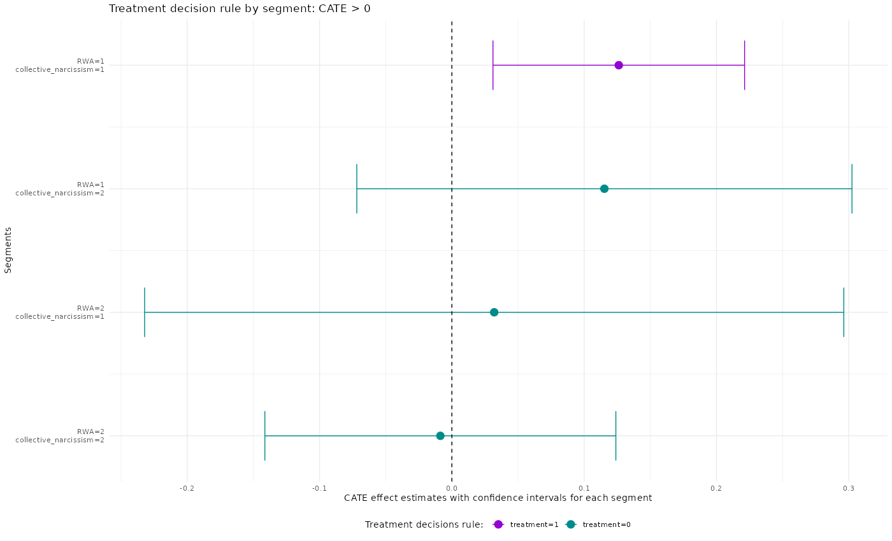

# Causal Segmentation Analysis
## with Netflix's `sherlock`

Expecting homogeneous effects from experimental treatments might border on naivety sometimes. Especially, if we have large samples in A/B testing.

This project is an implementation of estimating conditional average treatment effects for the heterogeneous groups in a sample.

The data consists of a convenient sample of German voters who were asked to report their socio-demographics and political orientation together with items on national identification, [collective narcissism](https://collectivenarcissism.com/)[^1], and right-wing-authoritarianism[^2]. Populist attitudes are measured before and after experimental treatment. The treatment is being exposed to a populist slogan in a demonstration setting and is contrasted with a demo with no slogans.

Results indicate a counter-intuitive finding, which reveals that those who are low both on right-wing authoritarianism and collective narcissism show an increase in their populism scores. None of the other segments in the sample are affected significantly.

[^1] Collective narcissism is a belief that the in-group is exceptional, entitled to privileged treatment but not sufficiently recognized by others.
[^2] A psychological trait that indicates the degree which an an individual is highly submissive to authority figures, acts aggressivley in the name of authority and is rigidly abiding by the conventional values.